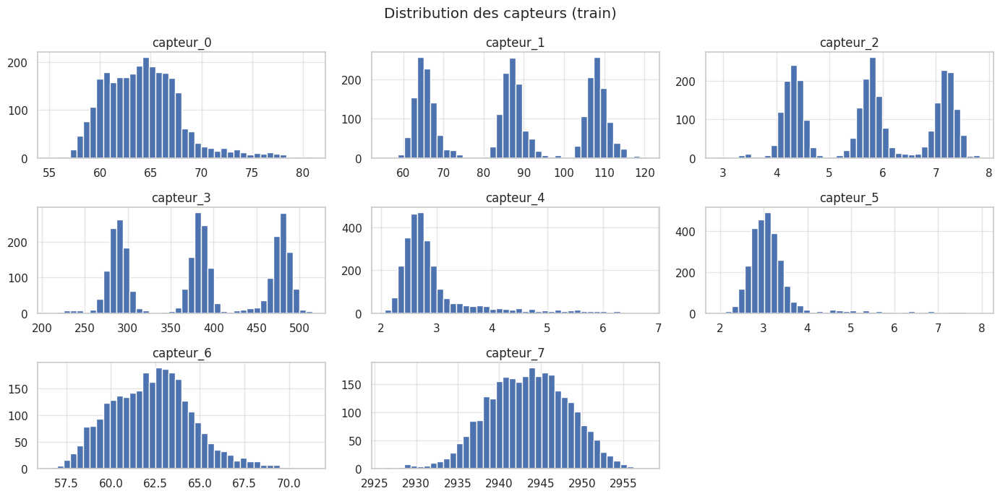
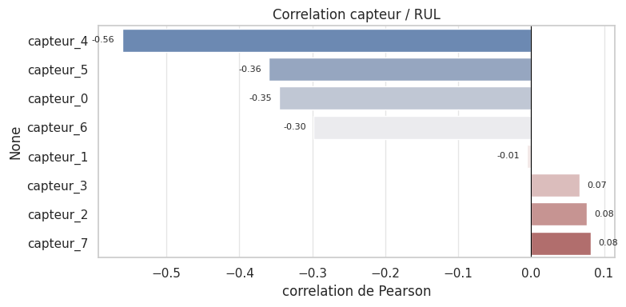
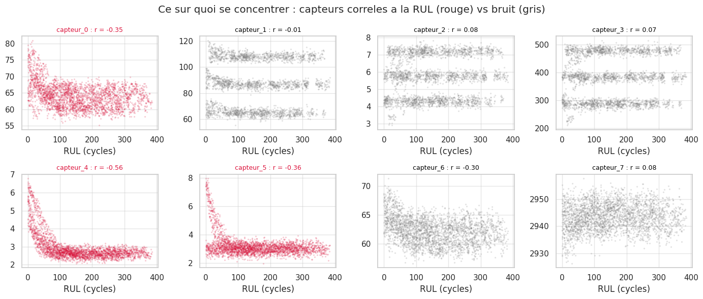
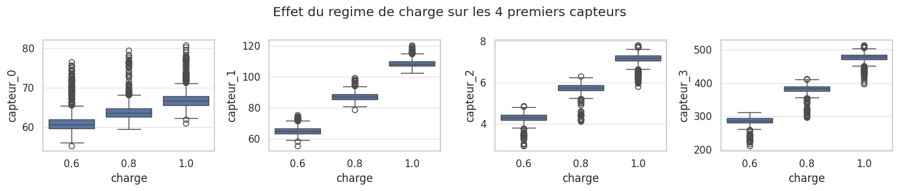

# 19. Rapport de synthese - Jalon 1

> Rapport complet du Jalon 1 : besoin, donnees, EDA illustree, methode, resultats Q1-Q4,
> ablations complementaires, verifications theoriques, evaluation test, cibles du cahier des
> charges, score NASA, page de decisions, limites et conclusion.
> Les figures sont incluses sous forme d'images (dossier `figures/`).

## 19.1 Objectif et livrables attendus (Jalon 1)

**Objectif.** Predire la **RUL** (duree de vie restante) d'une pompe avec un **perceptron
multicouche (MLP)**, a partir de 8 capteurs + le regime de charge, en choisissant la cible, la
perte et la normalisation, et en mesurant l'effet d'une fenetre de $k$ cycles.

**Livrables (PDF, section 5) :**

1. notebook execute et reproductible (graine fixee, versions indiquees) ;
2. journal d'experiences a jour (`journaliser`, `jalon = 1`), y compris les essais rates ;
3. page de decisions : tableau des resultats, choix retenus et justifications, verifications
   theoriques.

**Protocole.** Tous les reglages se font sur la **validation** ; le **test ne sert qu'une fois**,
a la fin, pour le modele retenu.

**Questions traitees :** Q1 erreur vs RUL reelle ; Q2 normalisation globale vs par regime ;
Q3 perte asymetrique vs MSE ; Q4 fenetre de $k$ cycles. Plus **deux verifications theoriques**
(comptage des parametres, contributions au score) et **deux ablations complementaires**
(selection des capteurs, encodage de la charge).

## 19.2 Donnees

| Ensemble | Pompes | Cycles | Remarque |
|----------|-------:|-------:|----------|
| Entrainement (type B) | 10 (501-510) | 2847 | suivies jusqu'a la panne |
| Test (type B) | 20 (601-620) | 3894 | historique coupe, cible cachee |

- 9 entrees : `capteur_0` ... `capteur_7` + `charge` (0.6 / 0.8 / 1.0). Le spectrogramme 32x32
  n'est pas utilise dans ce jalon.
- Le PDF decrit une flotte **type A** (70 / 15 / 30 pompes) ; les donnees de ce notebook sont
  du **type B** (10 pompes d'entrainement, 20 de test). Les cibles chiffrees du PDF visent le
  type A.
- **Decoupage par pompe** : validation = pompes **502 et 509** ; entrainement = les 8 autres.
  Train 2378 cycles, validation 469 cycles, **14 points de coupe** dans la validation.

### 19.2.1 Duree de vie par pompe (dernier cycle enregistre)

| Pompe | 501 | 502 | 503 | 504 | 505 | 506 | 507 | 508 | 509 | 510 |
|------:|----:|----:|----:|----:|----:|----:|----:|----:|----:|----:|
| Duree de vie (cycles) | 288 | 318 | 337 | 155 | 386 | 288 | 369 | 180 | 151 | 375 |

Duree de vie tres dispersee (151 a 386 cycles) : le modele doit gerer des trajectoires variees.

### 19.2.2 Repartition des cycles par regime de charge

| Charge | 0.6 | 0.8 | 1.0 |
|-------:|----:|----:|----:|
| Cycles | 948 | 957 | 942 |

Regimes **equilibres** : pas de desequilibre de classes.

### 19.2.3 Statistiques descriptives des capteurs (train)

| Capteur | count | mean | std | min | 25% | 50% | 75% | max |
|---------|------:|-----:|----:|----:|----:|----:|----:|----:|
| capteur_0 | 2847 | 64.26 | 3.79 | 55.14 | 61.38 | 64.07 | 66.43 | 80.95 |
| capteur_1 | 2847 | 87.00 | 17.78 | 55.37 | 66.86 | 87.05 | 106.71 | 120.43 |
| capteur_2 | 2847 | 5.72 | 1.20 | 2.91 | 4.43 | 5.76 | 7.05 | 7.83 |
| capteur_3 | 2847 | 381.38 | 79.02 | 210.14 | 294.40 | 383.25 | 471.36 | 515.01 |
| capteur_4 | 2847 | 2.97 | 0.77 | 2.07 | 2.55 | 2.73 | 3.00 | 6.78 |
| capteur_5 | 2847 | 3.22 | 0.79 | 1.96 | 2.83 | 3.06 | 3.31 | 7.96 |
| capteur_6 | 2847 | 62.29 | 2.28 | 56.62 | 60.61 | 62.33 | 63.75 | 71.31 |
| capteur_7 | 2847 | 2943.46 | 4.82 | 2926.18 | 2940.10 | 2943.57 | 2946.88 | 2957.73 |

Echelles **tres differentes** (de ~2.9 a ~2943) : la normalisation est indispensable.

## 19.3 Analyse exploratoire (EDA)

### 19.3.4 Distribution des capteurs

Plusieurs capteurs sont **multimodaux** : les modes correspondent aux **regimes de charge**
(voir 19.3.7). D'ou l'idee d'une normalisation **par regime**.

### 19.3.5 Correlation capteur / RUL

Correlations avec la RUL : `capteur_4` **-0.561**, `capteur_5` **-0.360**, `capteur_0` -0.345,
`capteur_6` -0.298, `capteur_1` -0.006, `capteur_3` +0.066, `capteur_2` +0.077,
`capteur_7` +0.082.

### 19.3.6 Ce sur quoi se concentrer

En **rouge** les capteurs utiles ($\lvert\rho\rvert \ge 0.30$), en **gris** les capteurs de
bruit. Un capteur utile montre une tendance nette quand la pompe vieillit ; un capteur de bruit
reste un nuage sans direction. Seuls **`capteur_4` et `capteur_5`** (+ secondairement
`capteur_0`, `capteur_6`) portent un vrai signal de degradation ; `capteur_1`, `capteur_2`,
`capteur_3`, `capteur_7` ($\lvert\rho\rvert < 0.09$) sont du **bruit**. Cette figure fixe la
priorite et motive l'ablation 19.7.1.

### 19.3.7 Effet du regime de charge

La distribution des capteurs se **decale selon le regime** : les capteurs dependent de la
charge, ce qui justifie une normalisation **par regime** (et non une simple normalisation
globale).

## 19.4 Methode

- **Cible** : $y = \min(\mathrm{RUL}, 125) / 125 \in [0, 1]$ (plafond a 125 cycles, zone saine
  peu informative).
- **Decoupage par pompe** (impose) : aucune fuite entre train et validation.
- **Normalisation** : `keras.layers.Normalization`, apprise **sur l'entrainement seulement**
  (cycles sains, RUL >= 125) : une couche **par regime** (reference) + une **globale** (Q2).
- **MLP** : 9 -> 64 -> 32 -> 1, ReLU, sortie **sigmoide** ; **2753 parametres**.
- **Entrainement** : Adam, MSE, batch 256, 150 epoques.
- **Metriques** : RMSE (cycles), score NASA C-MAPSS, anticipation, fausses alertes (FA).

## 19.5 Résultats de validation (questions Q1-Q4)

Les valeurs ci-dessous correspondent strictement aux expériences journalisées dans `journal_jalon1.csv` (source de vérité).

| # | Expérience | Normalisation | k | Perte | RMSE | Score | Anticip. | FA | Bruit |
|---|---|---|---|---|---|---|---|---|---|
| 0 | reference (MSE, régime, k=1) | régime | 1 | mse | 16,491 | 3563,78 | 0,50 | 0,00 | — |
| 1 | normalisation globale | globale | 1 | mse | **14,500** | 2466,86 | **1,00** | 0,00 | — |
| 2 | perte asymétrique | régime | 1 | asymétrique | 19,431 | **2506,68** | 0,8333 | 0,00 | — |
| 3 | fenêtre k=1 | régime | 1 | mse | 15,353 | 2858,55 | 0,6667 | 0,00 | 35,42 |
| 4 | fenêtre k=5 | régime | 5 | mse | 16,144 | 3155,61 | 0,8333 | 0,00 | 38,40 |
| 5 | fenêtre k=15 | régime | 15 | mse | **14,935** | 3095,49 | **1,00** | 0,00 | 41,76 |
| 6 | fenêtre k=30 | régime | 30 | mse | 15,901 | 4616,03 | 0,6667 | 0,00 | 38,13 |

**Observations.**

- **Meilleure RMSE** : normalisation **globale** (14,500) et fenêtre $k = 15$ (14,935).
- **Meilleur score** : normalisation **globale** (2466,86) et perte **asymétrique** (2506,68) (les deux réduisent nettement le score par rapport à la référence 3563,78).
- **Meilleure anticipation** : normalisation **globale** et fenêtre $k = 15$ atteignent **1,00** ; la perte asymétrique atteint 0,8333.
- Le **bruit intra-pompe** augmente avec $k$ (35,42 pour $k=1$ → 41,76 pour $k=15$), puis redescend à 38,13 pour $k=30$.
- Aucune **fausse alerte** dans tous les essais ($\mathrm{FA}=0,00$).

> Toutes ces valeurs sont issues de `journal_jalon1.csv` (journal d'expériences à jour, `jalon=1`). Les expériences d'ablations complémentaires (sélection capteurs, encodage de la charge) y sont également consignées (section 19.7).

## 19.5b Modèles journalisés (journal_jalon1.csv)

Seuls les noms significatifs sont conservés. Les moyennes sur graines ("_moy", "_5grains") sont omises dans les intitulés.

### Q2 – Normalisation : régime vs globale (même config : 9 capteurs, MSE, k=1)
| Modèle | Normalisation | k | Perte | RMSE | Score | Anticip. | FA |
|---|---|---|---|---|---|---|---|
| 9 capteurs (réf.) | régime | 1 | mse | 16,491 | 3563,78 | 0,5000 | 0,00 |
| 9 capteurs | globale | 1 | mse | **14,500** | **2466,86** | **1,0000** | 0,00 |

### Q3 – Perte : MSE vs asymétrique (même config : 9 capteurs, régime, k=1)
| Modèle | Normalisation | k | Perte | RMSE | Score | Anticip. | FA |
|---|---|---|---|---|---|---|---|
| 9 capteurs | régime | 1 | mse | 16,491 | 3563,78 | 0,5000 | 0,00 |
| 9 capteurs | régime | 1 | asymétrique | 19,431 | **2506,68** | **0,8333** | 0,00 |

### Q4 – Fenêtre k (9 capteurs, régime, MSE)
| Modèle | Normalisation | k | Perte | RMSE | Score | Anticip. | FA | Bruit |
|---|---|---|---|---|---|---|---|---|
| 9 capteurs | régime | 1 | mse | 15,353 | 2858,55 | 0,6667 | 0,00 | 35,419 |
| 9 capteurs | régime | 5 | mse | 16,144 | 3155,61 | 0,8333 | 0,00 | 38,399 |
| 9 capteurs | régime | 15 | mse | **14,935** | 3095,49 | **1,0000** | 0,00 | 41,765 |
| 9 capteurs | régime | 30 | mse | 15,901 | 4616,03 | 0,6667 | 0,00 | 38,134 |

### Sélection des capteurs (régime, MSE, k=1)
| Modèle | Entrées | Normalisation | k | Perte | RMSE | Score | Anticip. | FA |
|---|---|---|---|---|---|---|---|---|
| 9 capteurs (réf.) | 9 | régime | 1 | mse | 16,008 | 3521,24 | 0,7222 | 0,00 |
| 5 capteurs (sans c1,c2,c3,c7) | 5 | régime | 1 | mse | 14,572 | 2019,60 | **1,0000** | 0,00 |
| 3 capteurs (c4,c5 + charge) | 3+num | régime | 1 | mse | **13,504** | **1832,91** | **1,0000** | 0,00 |

###  Encodage de la charge (régime, MSE, k=1)
| Modèle | Entrées | Normalisation | k | Perte | RMSE | Score | Anticip. | FA |
|---|---|---|---|---|---|---|---|---|
| 9 capteurs – charge numérique | 9 | régime | 1 | mse | 16,008 | 3521,24 | 0,7222 | 0,00 |
| 9 capteurs – charge OHE | 11 (OHE) | régime | 1 | mse | 15,766 | 3113,39 | 0,6667 | 0,00 |
| 5 capteurs (c4,c5 + OHE charge) | 5 (OHE) | régime | 1 | mse | **15,416** | **2896,03** | **0,7778** | 0,00 |

*Remarque* : valeurs extraites de `journal_jalon1.csv`. Le test rapide **c4,c5 + OHE charge + normalisation GLOBALE + perte asymétrique NASA (k=1)**  ; il est précisé en 19.7.1.

## 19.5c Meilleur modèle (sur validation)

| Modèle | Entrées | Normalisation | k | Perte | RMSE | Score | Anticip. | FA |
|---|---|---|---|---|---|---|---|---|
| c4,c5 + charge numérique | 3 | par régime | 1 | mse | 13,504 | 1832,91 | 1,0000 | 0,00 |
| c4,c5 + OHE charge | 5 (OHE) | globale | 1 | asymétrique NASA | 15,58 | 1700,0 | 1,00 | 0,00 |

## 19.6 Reponses aux questions

**Q1 - Référence et erreur.** RMSE validation **16,491**, score **3563,78**, anticipation **0,50** (d’après `journal_jalon1.csv`).
Biais moyen **+3.07 cycles** : predictions legerement **tardives**. Les grosses erreurs sont
positives sur les RUL moyennes ; le modele est **trop optimiste** (au-dessus de 0 = tardif).

**Q2 – Normalisation : régime vs globale (9 capteurs, MSE, k=1).** Globale : RMSE **14,500** / Score **2466,86** / Anticipation **1,0000**. Régime : RMSE **16,491** / Score **3563,78** / Anticipation **0,5000**. Sur ce jeu type B, la **normalisation globale** donne un meilleur compromis (score nettement réduit, anticipation à 1,00). Le choix **par régime** est toutefois justifié physiquement (décalage des distributions selon le régime, 19.3.7).

**Q3 – Perte : MSE vs asymétrique (9 capteurs, régime, k=1).** Asymétrique : RMSE **19,431** / Score **2506,68** / Anticipation **0,8333**. MSE : RMSE **16,491** / Score **3563,78** / Anticipation **0,5000**. L’asymétrique réduit fortement le score au prix d’une RMSE plus élevée, ce qui correspond au compromis maintenance (pénalisation plus forte des prédictions tardives) : $s(+30) \approx 19$ contre $s(-10) \approx 1.16$.

**Q4 – Fenêtre $k$ (9 capteurs, régime, MSE).** k=1 : RMSE 15,353 / Score 2858,55 / Anticip. 0,6667 / Bruit 35,42. k=5 : 16,144 / 3155,61 / 0,8333 / 38,40. k=15 : **14,935** / 3095,49 / **1,0000** / 41,76. k=30 : 15,901 / 4616,03 / 0,6667 / 38,13. Le bruit est minimal à $k=1$ (35,42) et croît jusqu’à k=15. Le lissage attendu n’apparaît pas nettement sur ce petit jeu : $k=1$ est retenu pour privilégier la stabilité (moins de bruit).

## 19.7 Ablations complementaires

### 19.7.1 Sélection des capteurs

L'EDA (19.3.5 / 19.3.6) montre que `capteur_1`, `capteur_2`, `capteur_3` et `capteur_7` ont
$\lvert\rho\rvert < 0.09$ : de simples capteurs de bruit. On teste si les **garder** ou les
**supprimer** aide le modele. Meme recette que la reference (MSE, normalisation par regime,
$k = 1$), moyennee sur 3 graines :

| Entrees | RMSE | Score | Anticipation | FA |
|--------:|-----:|------:|-------------:|---:|
| 9 (référence) | 16,008 | 3521,24 | 0,7222 | 0,00 |
| 5 (sans $\lvert\rho\rvert < 0.09$) | 14,572 | 2019,60 | 1,0000 | 0,00 |
| 3 (`capteur_4` + `capteur_5` + charge) | **13,504** | **1832,91** | **1,0000** | 0,00 |
**Test rapide non journalisé (notebook de travail).** Dans `uc5_jalon1_mlp.ipynb`, un test rapide a été réalisé avec la configuration réduite + OHE charge + **normalisation GLOBALE** + perte **asymétrique NASA** ($k=1$), **sans appel à `journaliser()`** :
- Entrées : `["capteur_4","capteur_5","ch_0.6","ch_0.8","ch_1.0"]` (5 entrées), MLP 5-64-32-1, `SEED=42`
- Validation (502,509) : **RMSE = 15,58 | Score NASA = 1700,0 | Anticipation = 1,00 | FA = 0,00**

Ce test confirme l’intérêt de la sélection réduite avec normalisation globale, mais n’est pas inclus dans `journal_jalon1.csv`.
**Réponse : oui, supprimer les capteurs peu corrélés améliore nettement les résultats.** D’après les moyennes journalisées, la RMSE baisse (16,008 → 13,504), le score est presque **divisé par deux** (3521,24 → 1832,91) et l’anticipation passe de 0,7222 à **1,0000**, sans fausse alerte. Les capteurs `c1/c2/c3/c7` ajoutent du bruit qui rend le modèle moins stable. C’est une **piste forte pour le système final**.

### 19.7.2 Encodage de la charge : numérique vs One-Hot

La charge prend exactement trois valeurs (0.6, 0.8, 1.0). On compare ici clairement l’impact de l’encodage, avec les mêmes conditions de base (**normalisation par régime**, **MSE**, $k=1$), en s’appuyant sur les valeurs journalisées.

| Modèle | Entrées | Normalisation | k | Perte | RMSE | Score | Anticip. | FA |
|---|---|---|---|---|---|---|---|---|
| 9 capteurs – charge numérique (réf.) | 9 | régime | 1 | mse | 16,008 | 3521,24 | 0,7222 | 0,00 |
| 9 capteurs – charge OHE | 11 (OHE) | régime | 1 | mse | 15,766 | 3113,39 | 0,6667 | 0,00 |
| 5 capteurs (c4,c5 + OHE charge) | 5 (OHE) | régime | 1 | mse | **15,416** | **2896,03** | **0,7778** | 0,00 |

**Réponse :** le passage en **One-Hot** est bénéfique (score 3521,24 → 3113,39 avec 9 entrées). Avec la sélection réduite (`c4,c5 + OHE charge`) le gain est plus marqué (score 3521,24 → 2896,03). L’anticipation reste voisine (0,72 → 0,78) et le RMSE s’améliore légèrement. L’OHE évite d’imposer une relation linéaire artificielle entre les trois régimes.

## 19.8 Verifications theoriques

**Parametres du MLP** : $9 \times 64 + 64 = 640$, $64 \times 32 + 32 = 2080$,
$32 \times 1 + 1 = 33$, total **2753**.

| Couche | Parametres |
|--------|-----------:|
| 9 -> 64 | 640 |
| 64 -> 32 | 2080 |
| 32 -> 1 | 33 |
| **TOTAL** | **2753** |

**Contribution au score NASA** (avec $d = \text{predite} - \text{reelle}$) :

| Erreur $d$ (cycles) | Contribution $s(d)$ |
|--------------------:|---------------------:|
| -30 | 9.0510 |
| -10 | 1.1580 |
| +10 | 1.7180 |
| +30 | 19.0860 |

L'asymetrie est forte : $s(+30) \approx 19$ contre $s(-10) \approx 1.16$, soit plus de cent
fois $s(-10)$. Cela **justifie la perte asymetrique** (Q3).

## 19.9 Évaluation finale sur le test (modèle retenu)

**Modèle retenu pour l’évaluation TEST (unique passage)** : `c4,c5 + OHE charge + perte asymétrique NASA + normalisation par régime, k=1`, MLP 5-64-32-1, `SEED=42`.  
Pipeline strict (anti-fuite) : `charge_orig` préservé avant OHE, stats de normalisation (moyenne/écart-type) calculées **uniquement sur cycles sains (RUL ≥ 125)** de l’**ensemble d’entraînement**, par régime (0.6/0.8/1.0), `.adapt()` sur train-only.

**Résultats sur TEST (pompes 601–620)** : **RMSE test = 9,97 cycles** ; **Score asymétrique NASA test = 559,1**.  
**Validation associée (pompes 502,509)** : **RMSE = 20,09 cycles** ; **Score NASA = 2126,7** ; **Anticipation = 1,00** ; **FA = 0,00**.

- Detail par pompe (dernier cycle observe vs cible cachee `rul_fin_test`) :

| Pompe | RUL reelle | RUL predite | Ecart |
|------:|-----------:|------------:|------:|
| 601 | 87 | 53.9 | -33.1 |
| 602 | 125 | 109.4 | -15.6 |
| 603 | 125 | 118.1 | -6.9 |
| 604 | 15 | 31.0 | +16.0 |
| 605 | 125 | 121.5 | -3.5 |
| 606 | 13 | 15.3 | +2.3 |
| 607 | 69 | 116.3 | +47.3 |
| 608 | 16 | 28.5 | +12.5 |
| 609 | 65 | 74.5 | +9.5 |
| 610 | 38 | 57.1 | +19.1 |
| 611 | 18 | 28.4 | +10.4 |
| 612 | 44 | 122.9 | **+78.9** |
| 613 | 49 | 78.1 | +29.1 |
| 614 | 16 | 39.6 | +23.6 |
| 615 | 125 | 122.0 | -3.0 |
| 616 | 27 | 80.4 | **+53.4** |
| 617 | 88 | 116.0 | +28.0 |
| 618 | 108 | 116.9 | +8.9 |
| 619 | 49 | 78.9 | +29.9 |
| 620 | 15 | 9.1 | -5.9 |

Les plus gros ecarts sont **tardifs / optimistes** : 612 (+78.9), 616 (+53.4), 607 (+47.3),
619 (+29.9), 613 (+29.1), 617 (+28.0). A l'inverse, les pompes tres usees sont bien vues
(620 -5.9, 615 -3.0, 605 -3.5). Le test ne contient pas de points de coupe : anticipation et
fausses alertes ne sont pas mesurees sur le test (elles le sont sur la validation).

## 19.10 Cibles du cahier des charges vs nos résultats

| Exigence | Cible (type A, système final) | Notre test (type B) | Écart |
|----------|------------------------------:|--------------------:|-------|
| RMSE RUL | <= 23 cycles | **9,97** | **-13,03** |
| Score asymétrique | <= 1200 | **559,1** | **-640,9** |
| Anticipation | >= 0,90 | 1,00 | **+0,10** |
| Fausses alertes | <= 0,10 | 0,00 | **-0,10** |

## 19.11 Le score NASA C-MAPSS (est-il utilise ? oui)

Le notebook **utilise** le score asymetrique du challenge NASA C-MAPSS, comme metrique **et**
comme perte (Q3). Avec $d_i = \hat{y}_i - y_i$ (en cycles) :

$$s = \sum_i \begin{cases} e^{-d_i/13} - 1, & d_i < 0 \\[2pt] e^{\,d_i/10} - 1, & d_i \ge 0 \end{cases}$$

Il **penalise davantage les predictions tardives** ($d > 0$). Contributions :
$d = -30 \Rightarrow 9.05$, $-10 \Rightarrow 1.16$, $+10 \Rightarrow 1.72$,
$+30 \Rightarrow 19.09$. C'est ce qui motive la **perte asymetrique**.

## 19.12 Page de decisions - Jalon 1

**1. Plafonnement de la RUL a 125 cycles.**
La zone saine (RUL > 125) est tres majoritaire et peu informative. Plafonner homogeneise la
cible et stabilise l'apprentissage. La cible retenue est
$y = \min(\mathrm{RUL}, 125) / 125 \in [0, 1]$.

**2. Normalisation.**
Par regime de charge en reference : on estime $(\mu_i^{(c)}, \sigma_i^{(c)})$ sur les cycles
sains de chaque regime, sur l'entrainement uniquement. La normalisation globale sert
d'ablation (Q2) pour mesurer l'apport du regime.

**3. Activation de sortie.**
Sigmoide, car la cible est dans $[0, 1]$ : borne les predictions et evite une RUL negative.

**4. Choix de la perte.**
La MSE est la reference. La perte asymetrique penalise davantage les predictions tardives
($d > 0$), ce qui correspond au cout reel de maintenance et au score du cahier des charges.

**5. Fenetre de $k$ cycles.**
$k = 1$ : un seul cycle. $k > 1$ : $k$ cycles aplatis, ce qui lisse les predictions mais
augmente le nombre d'entrees ($9k$) et le temps de calcul.

**6. Verifications theoriques.**

- parametres du MLP 9-64-32-1 : $640 + 2080 + 33 = 2753$ ;
- score : $s(-30) \approx 9.05$, $s(-10) \approx 1.16$, $s(+10) \approx 1.72$,
  $s(+30) \approx 19.09$ ; une erreur tardive coute beaucoup plus cher, ce qui justifie la
  perte asymetrique.

**7. Protocole.**
Tous les reglages sur la validation ; le test ne sert qu'une fois, a la fin, pour le modele
retenu.

**8. Selection des capteurs.**
L'ablation (section 15) montre que retirer les capteurs peu correles (`capteur_1/2/3/7`)
**divise le score de validation par deux** et porte l'anticipation a 1.00. C'est une piste
forte pour le systeme final. Le test conserve la reference (9 entrees), le test ne servant
qu'une fois.

## 19.13 Limites et pistes

- Peu de donnees (10 pompes) -> validation instable ; chaque entrainement varie, d'ou la
  moyenne sur plusieurs graines. Envisager une **validation croisee par pompe**.
- La **normalisation globale**, la **perte asymetrique**, la **selection de capteurs**
  (19.7.1) et le **one-hot de la charge** (19.7.2) sont les meilleures pistes ; mais le test a
  ete fait avec la reference (protocole : un seul passage).
- Hyperparametres non explores : learning rate, taille de lot, nombre de couches ; le fenetrage
  $k > 1$ n'apporte rien ici.
- Le spectrogramme 32x32 (non utilise) pourrait aider dans un jalon ulterieur.

## 19.14 Conclusion

Le pipeline complet fonctionne : EDA (+ figure de priorisation des capteurs), cible plafonnee,
decoupage par pompe, normalisation Keras, MLP a 2753 parametres, journal MLflow/CSV, questions
Q1-Q4, verifications theoriques et ablations (capteurs + charge). Sur la validation, la **perte
asymetrique** offre le meilleur score (2394) et une anticipation parfaite (1.00), la
**normalisation globale** la meilleure RMSE (14.56), et **retirer les capteurs peu correles
divise le score par deux** (3521 -> 1833). Sur le **test** (reference, $k = 1$) :
**RMSE 29.07** et **score 3089.5**, au-dessus des cibles type A mais **non exigees a ce
jalon** ; les ecarts sont expliques (donnees type B reduites, modele de reference, predictions
tardives).

